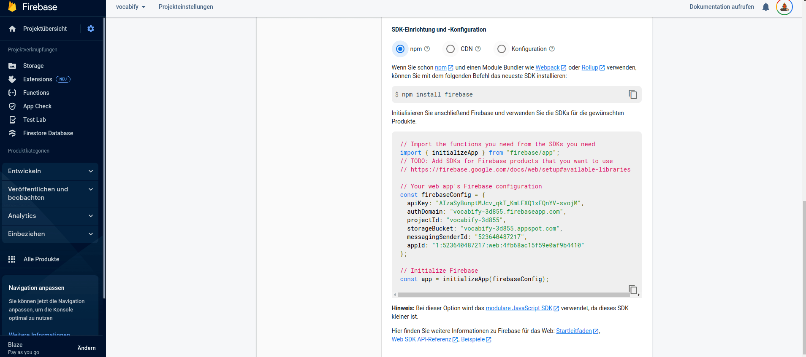

# Setup

It is highly recommend doing this setup on a Linux machine.

## Step 1

Clone the project and open it in your IDE(A).

```shell
git clone https://github.com/DeNic0la/vocabify.git && cd vocabify
```

## Step 2

There is a script for the setup if you are using Linux. For the setup with Linux read the [script tutorial](linux.md). Else follow these steps.

### Step 2.1

Make sure you have npm, firebase-tools and angular-cli installed.

### Step 2.2

Run these commands

```shell
firebase login
firebase projects:create
```

## Step 3

Go to the [firebase console](https://console.firebase.google.com/) and select the project you just created.
Add a new application to the project. Take a look at the [environment.prod.ts](../src/environments/environment.prod.ts) file and copy the values from the Firebase config into said file.


## Step 4

Make yourself an [Open-Ai-Api-Key](https://openai.com/api/) and add it as a Firebase secret. (Make sure you are using the right project `Firebase use {your project}`).

```shell
your_key=12345
firebase functions:secrets:set OPENAI_API_KEY $your_key
```

## Step 5

Deploy the functions:

```shell
cd functions
firebase deploy --only functions
cd ..
```

## Step 6

Build the frontend

```shell
ng build
```

Deploy the frontend

```shell
firebase deploy --only hosting
```

## Step 7

Congratulations your app is deployed, go to firebase to check the url you deployed the app to.
https://console.firebase.google.com/project/[YOUR_PROJECT]/hosting/sites
